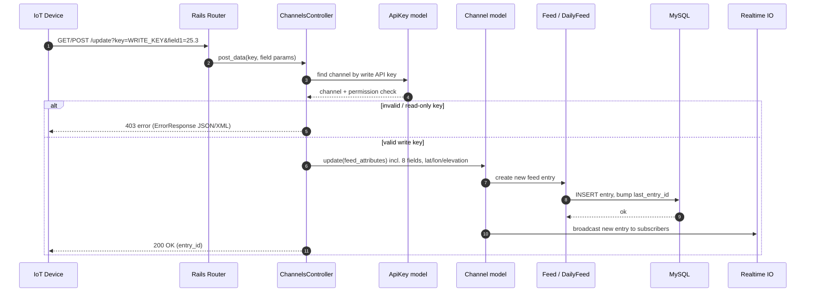
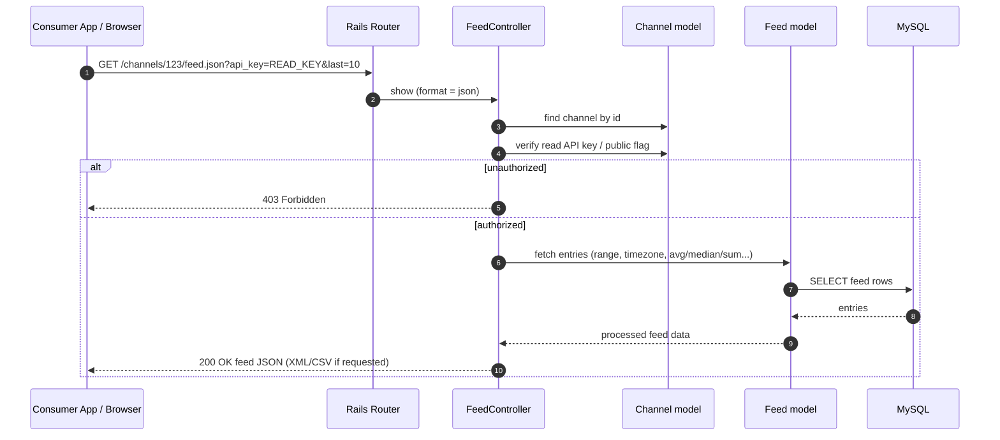
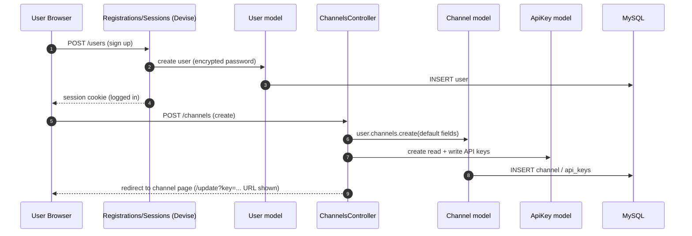

# ThingSpeak — Sequence Diagrams

## 1. Device writes data (`/update?key=API_KEY`)

```mermaid
sequenceDiagram
    autonumber
    participant D as IoT Device
    participant R as Rails Router
    participant C as ChannelsController
    participant K as ApiKey model
    participant CH as Channel model
    participant F as Feed / DailyFeed
    participant DB as MySQL
    participant RT as Realtime IO

    D->>R: GET/POST /update?key=WRITE_KEY&field1=25.3
    R->>C: post_data(key, field params)
    C->>K: find channel by write API key
    K-->>C: channel + permission check
    alt invalid / read-only key
        C-->>D: 403 error (ErrorResponse JSON/XML)
    else valid write key
        C->>CH: update(feed_attributes) incl. 8 fields, lat/lon/elevation
        CH->>F: create new feed entry
        F->>DB: INSERT entry, bump last_entry_id
        DB-->>F: ok
        CH->>RT: broadcast new entry to subscribers
        C-->>D: 200 OK (entry_id)
    end
```

## 2. Client reads a channel feed (JSON / XML / CSV)

```mermaid
sequenceDiagram
    autonumber
    participant A as Consumer App / Browser
    participant R as Rails Router
    participant FC as FeedController
    participant CH as Channel model
    participant F as Feed model
    participant DB as MySQL

    A->>R: GET /channels/123/feed.json?api_key=READ_KEY&last=10
    R->>FC: show (format = json)
    FC->>CH: find channel by id
    FC->>CH: verify read API key / public flag
    alt unauthorized
        FC-->>A: 403 Forbidden
    else authorized
        FC->>F: fetch entries (range, timezone, avg/median/sum...)
        F->>DB: SELECT feed rows
        DB-->>F: entries
        F-->>FC: processed feed data
        FC-->>A: 200 OK feed JSON (XML/CSV if requested)
    end
```

## 3. User signs up and creates a channel (web UI)

```mermaid
sequenceDiagram
    autonumber
    participant U as User Browser
    participant RG as Registrations/Sessions (Devise)
    participant USR as User model
    participant CC as ChannelsController
    participant CH as Channel model
    participant AK as ApiKey model
    participant DB as MySQL

    U->>RG: POST /users (sign up)
    RG->>USR: create user (encrypted password)
    USR->>DB: INSERT user
    RG-->>U: session cookie (logged in)
    U->>CC: POST /channels (create)
    CC->>CH: user.channels.create(default fields)
    CC->>AK: create read + write API keys
    CH->>DB: INSERT channel / api_keys
    CC-->>U: redirect to channel page (/update?key=... URL shown)
```
